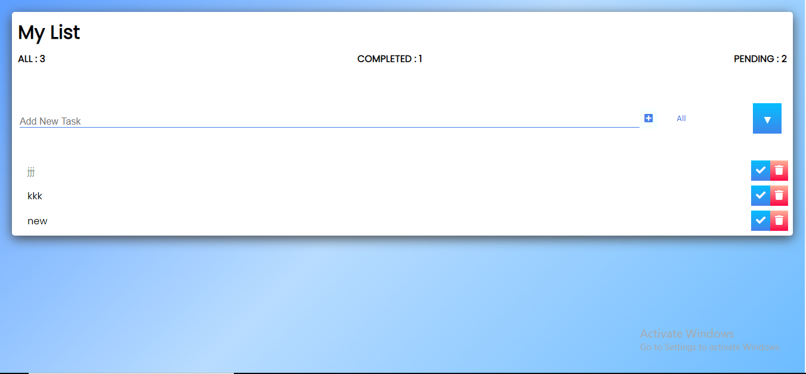
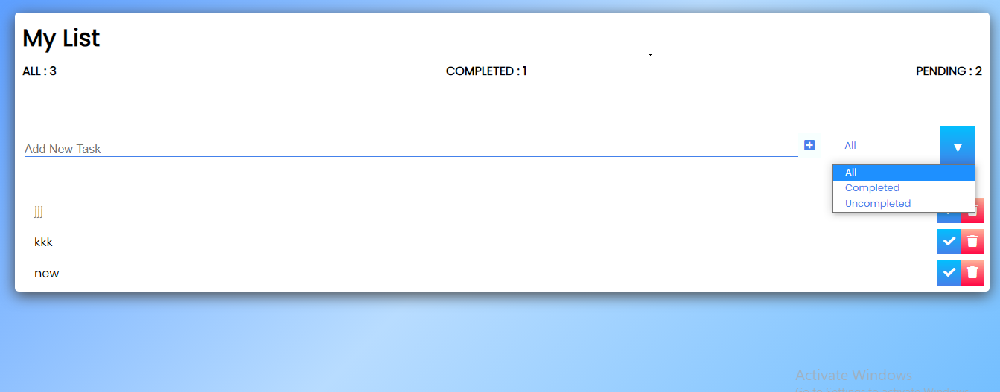

To do list built with ReactJs

You can add and delete tasks

You can view all, completed and pending/uncompleted tasks

Build Setup
# install dependencies
npm install

# serve with hot reload at localhost:3000
npm run dev

# build for production with minification
npm run build
